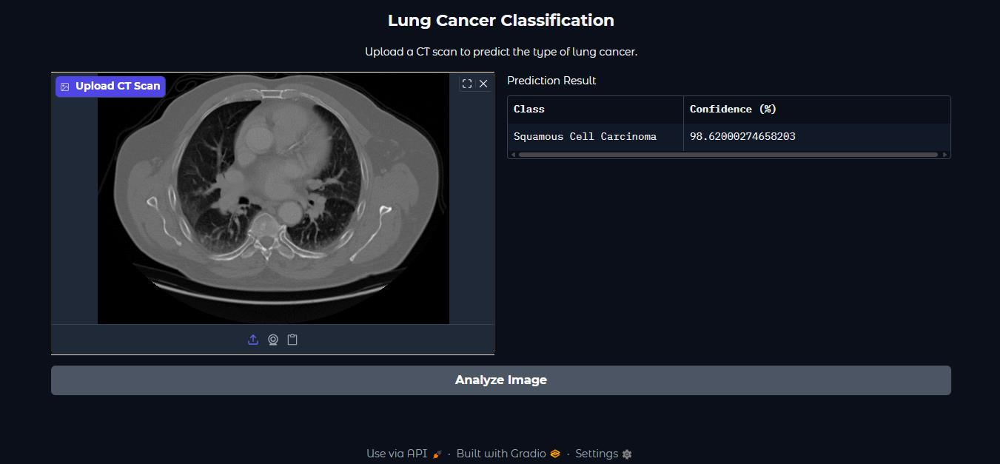

# 🫁 Lung Cancer Detection with Deep Learning



A deep learning-based CT scan classifier that identifies four lung tissue categories — Adenocarcinoma, Large Cell Carcinoma, Squamous Cell Carcinoma, and Normal Lung — using a fine-tuned DenseNet121 model with a Gradio web interface.

---

## 📋 Table of Contents

- [Overview](#overview)
- [Dataset](#dataset)
- [Model Architecture](#model-architecture)
- [Training](#training)
- [Results](#results)
- [Usage](#usage)
- [Project Structure](#project-structure)
- [Tech Stack](#tech-stack)

---

## Overview

This project applies transfer learning with **DenseNet121** (pre-trained on ImageNet) to classify lung CT scan images into four categories:

| Label | Description |
|-------|-------------|
| `Adenocarcinoma` | Most common form of lung cancer |
| `Large Cell Carcinoma` | Fast-growing, undifferentiated lung cancer |
| `Squamous Cell Carcinoma` | Linked to smoking; grows near bronchi |
| `Normal Lung` | Healthy lung tissue (no cancer) |

A **Gradio** web UI allows users to upload CT scan images and get instant predictions with confidence scores.

---

## Dataset

- **Train set:** 613 images across 4 classes
- **Test set:** 315 images across 4 classes
- Images resized to **224×224** pixels
- Pixel values normalized to `[0, 1]`

> Dataset is stored via Git LFS (`dataset.zip`, ~125 MB).

---

## Model Architecture

Base model: **DenseNet121** (ImageNet weights, top layer excluded)

Custom classification head added on top:

```
DenseNet121 (frozen during Phase 1)
    └── GlobalAveragePooling2D
    └── Dense(512, relu)
    └── BatchNormalization
    └── Dropout(0.5)
    └── Dense(256, relu)
    └── BatchNormalization
    └── Dropout(0.4)
    └── Dense(128, relu)
    └── BatchNormalization
    └── Dropout(0.3)
    └── Dense(4, softmax)   ← 4-class output
```

---

## Training

Training was done in **two phases** on Google Colab with GPU:

### Phase 1 — Feature Extraction (30 epochs)
- Base model **frozen**
- Optimizer: `Adam(lr=0.001)`
- Loss: `categorical_crossentropy`
- Best val accuracy: **~84.76%**

### Phase 2 — Fine-Tuning (25 epochs)
- Base model **unfrozen**
- Optimizer: `Adam(lr=0.0001)` (lower LR to avoid catastrophic forgetting)
- Best val accuracy: **~86.67%**

---

## Results

| Phase | Train Accuracy | Val Accuracy |
|-------|---------------|--------------|
| End of Phase 1 (Epoch 30) | ~94.71% | ~84.76% |
| End of Phase 2 (Epoch 4) | ~95.74% | **86.67%** |

---

## Usage

### Prerequisites

```bash
pip install gradio tensorflow numpy pandas
```

### Run the Gradio UI

```python
# Load model and launch UI
python UI.ipynb   # or run cells in Jupyter/Colab
```

Or run directly in **Google Colab**:

1. Mount Google Drive
2. Place `lung_cancer_model.keras` in your Drive path
3. Run `UI.ipynb` — a public Gradio link is generated automatically

### Inference Example

```python
from tensorflow.keras.models import load_model
from tensorflow.keras.preprocessing import image
import numpy as np

model = load_model('lung_cancer_model.keras')

class_labels = {
    0: 'Adenocarcinoma',
    1: 'Large Cell Carcinoma',
    2: 'Normal Lung',
    3: 'Squamous Cell Carcinoma'
}

img = image.load_img('scan.jpg', target_size=(224, 224))
img_array = image.img_to_array(img) / 255.0
img_array = np.expand_dims(img_array, axis=0)

prediction = model.predict(img_array)
predicted_class = class_labels[np.argmax(prediction)]
confidence = round(100 * np.max(prediction), 2)

print(f"Prediction: {predicted_class} ({confidence}%)")
```

---

## Project Structure

```
Lung-Nodules-with-Machine-learning/
│
├── main.ipynb                  # Model training pipeline
├── UI.ipynb                    # Gradio inference UI
├── lung_cancer_model.keras     # Saved model (Git LFS)
├── dataset.zip                 # CT scan dataset (Git LFS)
├── .gitattributes
└── README.md
```

---

## Tech Stack

- **Python 3.11**
- **TensorFlow / Keras** — model building & training
- **DenseNet121** — transfer learning backbone
- **Gradio** — web inference UI
- **NumPy / Pandas** — data handling
- **Google Colab** — training environment (GPU)
- **Git LFS** — large file storage for model & dataset

---

## ⚠️ Disclaimer

This project is for **educational purposes only** and is not intended for clinical or diagnostic use. Always consult a qualified medical professional for health-related decisions.

---

## License

MIT License — feel free to use, modify, and distribute with attribution.